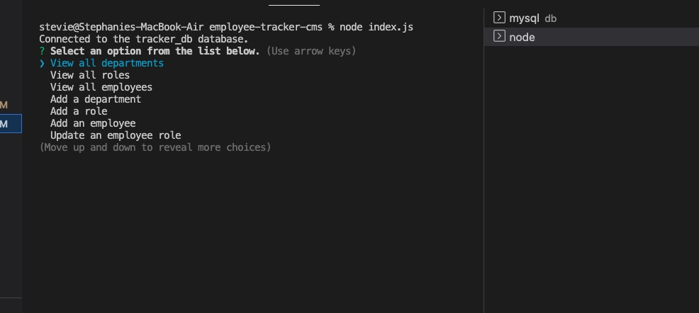

# employee-tracker-cms

  ## Description
  This is a command-line application was built without starter code and was designed to manage a company's employee database.
  
  ## Table of Contents
  
  - [Installation](#installation)
  - [Usage](#usage)
  - [Credits](#credits)
  - [Contributing](#contributing)
  - [Tests](#tests)
  - [Questions](#questions)
  
  ## Installation
  Clone employee-tracker-cms repo from GitHub https://github.com/smariagomez/employee-tracker-cms and then open that repo in your code editor (e.g., VS Code).
  
  ## Usage
  You will need to install npm mysql and mysql2. Once the repo has been opened in the your code editor you will run the command "node index.js" in the integrated terminal. After that step has been completed you will be led through a series of prompts where you will type in the requested employee and salary information. Every time you answer the necessary questions for a particular option selected you will be returned to the main table. When you select "quit" the prompts will discontinue.

  
  

  Walkthrough video tutorial: https://drive.google.com/file/d/1kOdV_WXgbzz6P-YDh_6p8keZYT6d_E4F/view
      
  ## Credits
 npm mysql, node.js
  
  ## Contributing
   Please review the [Contributor Covenant](https://www.contributor-covenant.org/) for guidlines on how to contribute to this application.
  
  ## Tests
  Currently there are no tests written for this application.

  ## Questions

  If you have any questions about the repo, you can open an issue or contact me directly at: stephaniemariagomez@gmail.com. See more of my work at https://github.com/smariagomez.